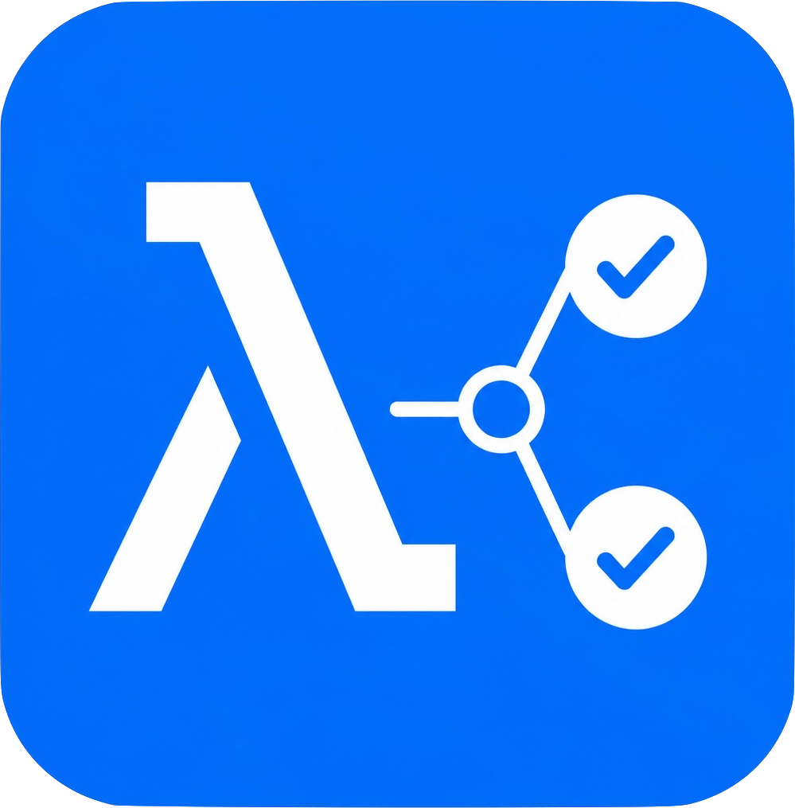
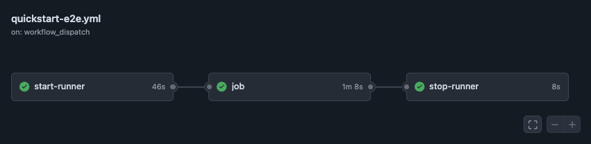

<p align="center">
  
</p>

# Lambda MicroVM GitHub Runner

Lambdas can run for 8 hours using MicroVMs. This runs GitHub Action jobs on top
of it.

<p align="center">
  
</p>

## Quickstart

Install the AWS CLI, GitHub CLI, `jq`, Docker, and Node.js 24. Authenticate both
CLIs, create a classic GitHub PAT with the `repo` scope, then run:

```bash
export AWS_REGION=us-east-1
export GITHUB_REPOSITORY=OWNER/PRIVATE_REPOSITORY

scripts/setup-quickstart.sh
```

The script uses your existing local AWS credentials to create the AWS resources,
runner image, roles, and a dedicated IAM user. It rotates that user's static
access key directly into GitHub Actions secrets and prompts for the classic PAT.
It does not use an infrastructure framework or write the AWS secret access key
to disk.

The stored IAM user is restricted to image building and runner lifecycle
operations. It cannot create or modify IAM identities, roles, policies, OIDC
providers, buckets, or log groups. Use it only with private repositories and
trusted workflow changes. See
[advanced credentials](docs/advanced-credentials.md) to replace both long-lived
credentials with GitHub OIDC and a GitHub App.

To preview cleanup of the Quickstart resources:

```bash
export GITHUB_REPOSITORY=OWNER/PRIVATE_REPOSITORY
scripts/teardown-quickstart.sh
```

Re-run with `--yes` to delete the generated repository secrets/variables, IAM
user, IAM roles, MicroVM image, artifact bucket, and CloudWatch log groups.

## Usage

Copy [examples/basic.yml](examples/basic.yml) into the private repository's
`.github/workflows/` directory.

> [!TIP] The Quickstart script configures every variable and secret referenced
> by this workflow.

For a job that runs inside a Node 24 container and talks to a Redis service
container, see
[examples/container-services.yml](examples/container-services.yml).

```yaml
name: Lambda MicroVM runner

on:
  workflow_dispatch:

permissions:
  contents: read

jobs:
  start-runner:
    runs-on: ubuntu-latest
    outputs:
      label: ${{ steps.start.outputs.label }}
      microvm-id: ${{ steps.start.outputs.microvm-id }}
      region: ${{ steps.start.outputs.region }}
    steps:
      - uses: aws-actions/configure-aws-credentials@v6
        with:
          aws-access-key-id: ${{ secrets.AWS_ACCESS_KEY_ID }}
          aws-secret-access-key: ${{ secrets.AWS_SECRET_ACCESS_KEY }}
          aws-region: ${{ vars.MICROVM_AWS_REGION }}

      - uses: neebs12/lambda-microvm-github-runner@v1
        id: start
        with:
          mode: start
          github-token: ${{ secrets.GH_PERSONAL_ACCESS_TOKEN }}
          image-id: ${{ vars.MICROVM_RUNNER_IMAGE_ARN }}
          image-version: ${{ vars.MICROVM_RUNNER_IMAGE_VERSION }}
          execution-role-arn: ${{ vars.MICROVM_EXECUTION_ROLE_ARN }}
          cloudwatch-log-group: ${{ vars.MICROVM_RUNTIME_LOG_GROUP }}
          max-lifetime-seconds: "3600"

  job:
    needs: start-runner
    runs-on: ${{ needs.start-runner.outputs.label }}
    steps:
      - uses: actions/checkout@v6
      - run: uname -a
      - run: docker info
      - run: docker buildx version
      - run: docker compose version

  stop-runner:
    if: ${{ always() }}
    needs: [start-runner, job]
    runs-on: ubuntu-latest
    steps:
      - uses: aws-actions/configure-aws-credentials@v6
        with:
          aws-access-key-id: ${{ secrets.AWS_ACCESS_KEY_ID }}
          aws-secret-access-key: ${{ secrets.AWS_SECRET_ACCESS_KEY }}
          aws-region: ${{ needs.start-runner.outputs.region }}

      - uses: neebs12/lambda-microvm-github-runner@v1
        with:
          mode: stop
          microvm-id: ${{ needs.start-runner.outputs.microvm-id }}
```

The start job emits a unique label for one target job. The runner is JIT-only
and single-use. Its supervisor self-terminates after that job; the explicit stop
job and platform maximum duration are independent cleanup backstops.

## Warm build servers (experimental)

Ordinary `start` and `stop` remain fully ephemeral: they create and terminate a
MicroVM for one job. Warm mode is an explicit opt-in that lets trusted jobs
reuse a suspended MicroVM as a short-lived build server. Its memory, Docker
layers, package caches, and downloaded toolchains remain available, but every
job still receives a fresh, single-use GitHub JIT runner registration.

Give `start` a stable, human-readable `server` pool name and the
Quickstart-created `MICROVM_WARM_STATE_TABLE`. Pass the opaque `server` output
to `stop`; warm `stop` releases the lease and suspends the MicroVM instead of
terminating it.

One warm pool member follows this lifecycle:

```text
                         server: docker-builds

 first start           target job #1                stop
      |                      |                         |
      v                      v                         v
 create MicroVM -> fresh JIT runner -> cache on disk -> suspend
                                                          |
 next start                                               |
      |                                                   |
      +--------------- resume same MicroVM <--------------+
                              |
                              v
                       fresh JIT runner
                              |
                              v
                       target job #2 -> suspend
                              |
                    cached state is still present
```

That makes warm mode useful for repeated, compatible workloads:

- Docker can reuse its native image and build-layer cache without exporting a
  cache archive between jobs.
- Package managers and build tools can reuse downloads, intermediate outputs,
  and installed toolchains left on the machine.
- A named pool can serve multiple workflow runs. Conditional DynamoDB leases
  ensure that only one job owns a particular MicroVM at a time.
- Suspended members retain memory and disk state without remaining active
  between jobs. Lambda's maximum lifetime still provides a final cleanup
  boundary.

The complete pattern uses the `server` output—not the human-readable pool
name—when releasing the exact lease:

```yaml
jobs:
  start-runner:
    runs-on: ubuntu-latest
    outputs:
      label: ${{ steps.start.outputs.label }}
      server: ${{ steps.start.outputs.server }}
      warm-hit: ${{ steps.start.outputs.warm-hit }}
      region: ${{ steps.start.outputs.region }}
    steps:
      - uses: aws-actions/configure-aws-credentials@v6
        with:
          aws-access-key-id: ${{ secrets.AWS_ACCESS_KEY_ID }}
          aws-secret-access-key: ${{ secrets.AWS_SECRET_ACCESS_KEY }}
          aws-region: ${{ vars.MICROVM_AWS_REGION }}

      - uses: neebs12/lambda-microvm-github-runner@v1
        id: start
        with:
          mode: start
          github-token: ${{ secrets.GH_PERSONAL_ACCESS_TOKEN }}
          image-id: ${{ vars.MICROVM_RUNNER_IMAGE_ARN }}
          image-version: ${{ vars.MICROVM_RUNNER_IMAGE_VERSION }}
          execution-role-arn: ${{ vars.MICROVM_EXECUTION_ROLE_ARN }}
          server: docker-builds
          server-capacity: "2"
          state-table: ${{ vars.MICROVM_WARM_STATE_TABLE }}
          max-lifetime-seconds: "7200"

  build:
    needs: start-runner
    runs-on: ${{ needs.start-runner.outputs.label }}
    steps:
      - uses: actions/checkout@v6
      - run: docker build --tag app:ci .

  stop-runner:
    if: ${{ always() && needs.start-runner.outputs.server != '' }}
    needs: [start-runner, build]
    runs-on: ubuntu-latest
    steps:
      - uses: aws-actions/configure-aws-credentials@v6
        with:
          aws-access-key-id: ${{ secrets.AWS_ACCESS_KEY_ID }}
          aws-secret-access-key: ${{ secrets.AWS_SECRET_ACCESS_KEY }}
          aws-region: ${{ needs.start-runner.outputs.region }}

      - uses: neebs12/lambda-microvm-github-runner@v1
        with:
          mode: stop
          server: ${{ needs.start-runner.outputs.server }}
```

`warm-hit` reports whether `start` resumed an existing member. An available
member always wins. When every member is busy, `server-capacity` optionally
limits whether that request may create another member; omitting it leaves pool
growth unbounded by the Action.

> [!WARNING] A reused machine is a cache, not an isolation boundary. A trusted
> job has root-equivalent access through Docker and can alter state consumed by
> later jobs. Use a warm pool only for equally trusted workflows in the same
> private repository. Fork pull requests are rejected. Warm caches are
> temporary, may expire, and do not guarantee that every workload becomes
> faster.

See the copy-ready [warm-cache workflow](examples/warm-cache.yml) and the
[warm-cache design and testing guide](docs/warm-cache.md) for lifecycle,
security, failure-recovery, and capacity details.

## Status

The Action implements and tests:

- strict mode-dependent Action input parsing;
- collision-resistant runner identity and deterministic launch client tokens;
- masked gzip/base64 JIT payloads with a 4,096-byte limit;
- bounded full-jitter retry and quota-aware polling;
- repository JIT creation and exact-runner readiness polling;
- idempotent Lambda MicroVM launch, readiness, cleanup, and termination;
- typed GitHub and AWS adapters with mocked-boundary integration tests.

The production AL2023 runner image is implemented and validated locally and
through the AWS image build hooks. Docker prefers `overlay2`, falls back to the
copy-on-write `fuse-overlayfs`, and retains `vfs` as the final compatibility
fallback. The complete private-repository workflow is validated for success, job
failure, cancellation, startup timeout, service containers, and the
maximum-duration backstop.

## Development

Node.js 24 is required.

```bash
npm ci
npm run check
```

`dist/index.js` is committed because GitHub Actions executes the bundled
artifact directly.

## Product boundaries

Version 1 is ARM64, JIT-only, repository-scoped, and intended for private
repositories with trusted workflow changes. It has no webhook, queue,
dispatcher, shell ingress, persistent GitHub runner registration, or boot-time
package installation. Warm MicroVM reuse is experimental and opt-in.

Detailed guides:

- [installation](docs/installation.md)
- [advanced credentials](docs/advanced-credentials.md)
- [security model](docs/security.md)
- [operations and quotas](docs/operations.md)
- [testing and release gates](docs/testing.md)
- [warm-cache implementation and testing plan](docs/warm-cache.md)
- [runner image](runner-image/README.md)

### Performance evidence

Benchmark harnesses, raw measurements, and research notes are maintained
separately from the Action's product code. Public articles and reproducible
summaries will be linked here as they are published.

## Credits and inspirations

This project is a small, purpose-built variation on existing runner and Lambda
MicroVM work:

- [mkdev-me/terraform-aws-github-runner-lambda-microvms](https://github.com/mkdev-me/terraform-aws-github-runner-lambda-microvms/tree/main)
  for the Terraform-centric Lambda MicroVM runner approach using webhooks,
  GitHub Apps, and dispatcher-style orchestration.
- [machulav/ec2-github-runner](https://github.com/machulav/ec2-github-runner)
  for the start/stop Action shape and general ephemeral runner lifecycle. This
  Action follows that simple workflow model, but uses Lambda MicroVMs instead of
  EC2 as the runtime.
- [Some notes on Lambda MicroVMs](https://awsteele.com/blog/2026/06/23/some-notes-on-lambda-microvms.html)
  by Aidan Steele for practical observations on Lambda MicroVM snapshots,
  lifecycle hooks, and Docker behavior inside MicroVMs.

The implementation also leans on the primary platform documentation:

- [AWS Lambda MicroVMs](https://docs.aws.amazon.com/lambda/latest/dg/lambda-microvms-guide.html)
  and
  [MicroVM images](https://docs.aws.amazon.com/lambda/latest/dg/microvms-images.html)
  for the image-build, snapshot, hook, and launch model.
- [GitHub self-hosted runner REST API](https://docs.github.com/en/rest/actions/self-hosted-runners)
  and
  [secure use of just-in-time runners](https://docs.github.com/en/actions/reference/security/secure-use#using-just-in-time-runners)
  for repository-scoped JIT runner registration and lifecycle behavior.
- GitHub Actions docs for
  [running jobs in a container](https://docs.github.com/actions/using-jobs/running-jobs-in-a-container)
  and
  [service containers](https://docs.github.com/actions/using-containerized-services)
  for the container and Redis service example.

## License

MIT
