# Repeated suspend/resume build-server benchmark methodology

Status: proposed methodology for review. The existing benchmark implementation
and the published 2026-07-19 results use an earlier, single-resume design. They
must not be described as results from this methodology.

## Objective

The benchmark should answer one primary question:

> When the same Lambda MicroVM is reused as a build server across multiple job
> boundaries, does its evolving on-machine build state make each new build
> faster than building the same revision on a clean MicroVM?

A job boundary is represented by suspending the MicroVM after a build and
resuming it before the next build. Every primary measurement therefore happens
after a resume and before the following suspension.

The benchmark should also establish:

- whether Docker images, layers, BuildKit cache, npm cache, and compiler
  artifacts remain correct and reusable across repeated cycles;
- the first-build cost after every resume, without accidentally warming Docker
  first;
- whether performance or free disk space degrades over successive cycles;
- suspend and resume control-plane latency; and
- whether a resumed server is faster end to end than provisioning a clean server
  for the same revision.

This benchmark does not measure GitHub queueing or JIT runner-registration
latency. Those belong in a separate Action-level E2E benchmark.

## Experimental unit and sample size

The experimental unit is one MicroVM observed repeatedly, not each individual
build as though all builds were independent.

The default run should use:

- nine persistent ARM64 MicroVMs;
- one seed build per persistent server;
- five measured suspend/resume/build/suspend cycles per server;
- 45 warm changed-build samples in total; and
- one matched clean-MicroVM build for every warm server and cycle, giving 45
  clean-control samples.

The nine persistent servers run as concurrent lanes. Clean controls may run at
lower bounded concurrency to respect account quota, but should be interleaved
with warm cycles rather than all being run at the beginning or end.

If quota prevents the full design, reduce concurrency before reducing the number
of repeated cycles. The report must state requested and actual counts.

## Workload

The primary workload is a multi-stage Node 24 Docker image that builds a
500-module TypeScript project. All external inputs must be pinned:

- base images by digest;
- npm dependencies with a committed lockfile;
- the TypeScript version; and
- the benchmark source generator and runner-image artifact by commit or SHA-256.

Revision zero is the seed. Each measured cycle creates a deterministic,
cumulative source revision using the server lane and cycle number. The mutation
must change application source and expected output without changing dependency
manifests. This invalidates the source-copy and compile layers while leaving
dependency layers eligible for reuse.

Each resulting image receives a cycle-specific tag and remains present until the
server is terminated. This models a build server producing new images over time
and makes disk growth observable.

Secondary workloads use separate persisted paths so their caches do not
overwrite one another:

- `npm ci` after deleting `node_modules`, using a persistent npm cache volume;
- an incremental TypeScript build after changing one module, retaining
  `tsbuildinfo` and prior output; and
- an immediate exact Docker rebuild after the primary changed build.

The primary Docker build must remain the first Docker operation after every
resume. Secondary workloads happen only after it.

## Lifecycle

```mermaid
flowchart LR
    A["Launch persistent MicroVM"] --> B["Create revision 0 and seed caches"]
    B --> C["Verify seed artifacts"]
    C --> D["Suspend"]
    D --> E["Resume and wait for RUNNING"]
    E --> F["Create next deterministic revision"]
    F --> G["Time first changed Docker build"]
    G --> H["Verify image and artifacts"]
    H --> I["Time exact rebuild and secondary workloads"]
    I --> J["Record cache and disk state"]
    J --> K{"More cycles?"}
    K -- Yes --> D
    K -- No --> L["Terminate"]
```

### Seed phase

For each persistent server:

1. Launch a MicroVM and time the transition to `RUNNING`.
2. Establish shell readiness without invoking Docker.
3. Create revision zero of the benchmark context.
4. Time the seed Docker build.
5. Run the image and verify revision-zero output.
6. Seed the npm and TypeScript incremental caches.
7. Record Docker driver, image/layer metadata, cache usage, and disk usage.
8. Suspend the MicroVM and wait for `SUSPENDED`.

The seed build is reported separately. It is not included in the repeated warm
percentiles.

### Measured cycle

For cycle `n` on each persistent server:

1. Start the resume timer immediately before the resume API call.
2. Resume the same MicroVM and wait for `RUNNING`.
3. Record resume-to-`RUNNING` latency.
4. Establish shell readiness using a no-op command. Do not run `docker info`,
   `docker image inspect`, `docker run`, a container health check, or any other
   Docker command.
5. Create deterministic source revision `n`. Do not include source-generation
   time in the Docker-build-only measurement.
6. Start a monotonic timer immediately before invoking `docker build`.
7. Build a new cycle-specific image using the previous cycles' normal Docker and
   BuildKit caches. Do not use `--no-cache`, prune, pull, or pre-inspect the
   cache.
8. Stop the build timer only after the Docker process exits. Record command
   duration and resume-call-to-build-complete duration separately.
9. Run the new image and verify its output contains the exact lane and cycle
   revision. A fast build with incorrect or stale output is a failed sample.
10. Time one immediate unchanged rebuild as a secondary exact-cache measurement.
11. Time the npm and incremental TypeScript artifact workloads and verify their
    outputs.
12. Record the Docker storage driver, image and cache metadata, root free space,
    Docker data-root usage, and workload hashes.
13. Start the suspend timer immediately before the suspend API call, suspend the
    MicroVM, and wait for `SUSPENDED`.
14. Record suspend-to-`SUSPENDED` latency.

No build occurs while the server remains running between cycles. A successful
cycle always ends suspended, so the next primary build necessarily follows a new
resume.

### Matched clean control

For every persistent lane and cycle, build the identical source revision on a
fresh MicroVM created from the same runner image:

1. Launch the clean MicroVM and record provision-to-`RUNNING` latency.
2. Establish shell readiness without invoking Docker.
3. Materialize the exact same source revision and verify its hash matches the
   corresponding warm input.
4. Time the first Docker build and verify the resulting output.
5. Record resources, storage driver, disk state, and the same build metadata.
6. Terminate the clean MicroVM; never reuse it as another clean control.

“Clean” means the MicroVM contains no benchmark-created state. Layers baked into
the common runner image are allowed because both cohorts begin from that same
image. The report must not call this a cold network pull unless the design
explicitly guarantees one.

## Measurements

### Primary

- warm changed-image build duration for the first Docker command after resume;
- matched clean changed-image build duration;
- paired warm/clean speedup for the same lane and revision; and
- resume-call-to-warm-build-complete versus
  provision-call-to-clean-build-complete.

### Secondary

- seed Docker build duration;
- exact rebuild duration immediately after each changed-image build;
- npm install duration with a persisted cache and no `node_modules`;
- incremental TypeScript artifact-build duration;
- resume-to-`RUNNING` and suspend-to-`SUSPENDED` duration;
- image execution and artifact verification success;
- Docker data-root and root-filesystem growth per cycle;
- cache/layer reuse reported by BuildKit; and
- failures, retries, unexpected MicroVM state transitions, and cleanup outcome.

All command durations use a monotonic clock inside the guest. Control-plane
durations use a monotonic clock in the orchestrator. Store unrounded millisecond
values in raw output and round only for presentation.

## Controls against misleading results

- Never invoke Docker between resume and the primary timed build.
- Never perform an exact-cache build and present it as a new-image build.
- Never compare a warm changed build only with an exact-cache build.
- Use the same source revision, base-image digest, runner-image version,
  architecture, Region, and requested resources for each matched pair.
- Record the resources actually visible inside every guest; requested memory is
  a minimum and must not be presented as the observed allocation.
- Preserve normal caches between warm cycles. Do not prune or manually prewarm
  them.
- Interleave clean controls with warm measurements to expose time-of-day or
  service-load effects.
- Keep failed measurements in the raw data. Exclude a sample only under a
  documented infrastructure-failure rule, and report every exclusion.
- Publish raw per-server, per-cycle samples and exact source/artifact hashes.
- Do not treat 45 repeated measurements as 45 independent servers. Report both
  pooled distributions and per-server results.

## Statistical reporting

Use nearest-rank percentiles and publish at least:

- count, minimum, p50, p90, p95, maximum, and arithmetic mean;
- primary metrics pooled across all warm cycles;
- the same metrics separately for each cycle number;
- each server's median across cycles;
- paired warm/clean ratios for every lane and cycle;
- the proportion of matched pairs in which the warm build is faster;
- first-cycle versus final-cycle performance and disk growth; and
- correctness and lifecycle success rates.

The server is the replication unit. Cycle-level measurements are repeated
observations within a server. If confidence intervals are added, resample by
server rather than treating each cycle as independent.

Do not discard the first post-resume build. It is the primary measurement. Exact
rebuilds are a separate secondary series.

## Proposed decision rules

The persistent build-server claim is supported only when:

- every reported image and artifact passes revision-specific verification;
- every persistent server completes all planned cycles, or any incomplete lane
  is disclosed without silently replacing its samples;
- at least 80% of matched warm builds are faster than their clean controls;
- the paired p50 warm speedup is at least `2.0x`; and
- no cache corruption, wrong-revision output, or unhandled active MicroVM
  remains after cleanup.

These thresholds are proposed before running the benchmark so they cannot be
chosen after seeing the results. Results below a performance threshold remain
useful and must be published honestly; they simply do not support the stronger
speedup claim.

Repeated lifecycle correctness and performance are separate conclusions. A run
may prove that state survives while showing that the speedup is too small or
inconsistent to market.

## Output schema and evidence

Raw output should identify every sample with:

- run ID, lane ID, MicroVM ID hash, cohort, and cycle;
- runner-image name/version and artifact SHA-256;
- source revision and input-tree hash;
- output artifact or image digest;
- storage driver, observed CPU and memory, and filesystem sizes;
- build-only, lifecycle, and lifecycle-plus-build durations;
- pre- and post-cycle disk/cache usage;
- verification result and failure category; and
- timestamps sufficient to reconstruct execution order.

Published evidence should include:

- this frozen methodology and the implementation commit;
- the raw machine-readable samples;
- the generated aggregate summary;
- a human-readable report with limitations;
- sanitized orchestrator logs; and
- confirmation that all temporary MicroVMs, images, objects, and credentials
  were removed.

Account identifiers, shell tokens, credentials, and private repository details
must be removed without altering measurement values.

## Safety and cleanup

- Use a maximum MicroVM duration comfortably longer than the planned run but no
  longer than the service's eight-hour ceiling.
- Terminate every clean control immediately after its measurement.
- Keep persistent servers only for the planned repeated cycles and terminate
  them in a `finally` path.
- On interruption, enumerate all MicroVMs created by the benchmark run and
  terminate any non-terminal resource.
- Delete temporary image resources, object-storage artifacts, and repository
  credentials after results are collected.
- End every report with the observed count of remaining non-terminated benchmark
  MicroVMs.

## Interpretation limits

This design demonstrates reuse within one account, Region, runner image, and
preview-service period. It does not establish an SLA, cross-Region behavior,
eight-hour durability, GitHub job pickup time, registry-push performance, or
performance for every Docker storage driver.

Report `overlay2`, `fuse-overlayfs`, and `vfs` separately. Results from one
driver must not be generalized to another. The production `vfs` fallback is a
correctness mechanism and should not be described as a high-performance build
cache without its own repeated-cycle data.
