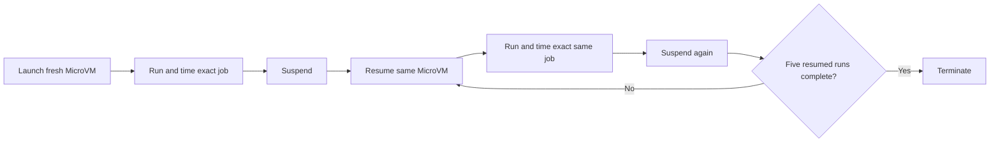

# Fresh versus resumed exact-job benchmark methodology

Status: proposed for agreement before implementation or another AWS run.

The existing 2026-07-19 benchmark used a different, single-resume design. Its
results must not be presented as results from this methodology.

## The question

> How long does the exact same build job take on a fresh MicroVM versus on that
> same MicroVM after it has completed the job, suspended, and resumed?

That is the whole experiment. We are testing the value of state left by an
earlier run: Docker cache, npm cache, and TypeScript build artifacts.

We are not changing the source between runs. We are not testing a new source
revision, concurrency, GitHub queueing, or a separate clean-control fleet.

## Fresh and resumed

**Fresh** means the first benchmark job on a newly provisioned MicroVM. It uses
the normal immutable runner image and its built-in tools, but has no
benchmark-created Docker cache, npm cache, TypeScript artifacts, or prior
workspace state.

**Resumed** means the same MicroVM ID after it has:

1. completed that exact job;
2. reached `SUSPENDED`; and
3. returned to `RUNNING` through the normal production resume path.

The fresh first run seeds the state. Every resumed run consumes and refreshes
that state before the server suspends again.

## Test shape

The default run uses nine persistent ARM64 MicroVMs. Each server performs:

1. one fresh job;
2. suspend;
3. resume and run the exact same job;
4. suspend; and
5. repeat the resume/job/suspend cycle five times.

This produces:

- nine fresh-job samples; and
- 45 resumed-job samples across five cycles.

Each server is its own control. No separate clean MicroVM is needed for every
cycle.

## The exact job

Every fresh and resumed run uses the same:

- source-tree hash;
- package lockfile;
- Dockerfile and Docker context;
- Node, npm, and TypeScript versions;
- base-image digests;
- commands and command order; and
- expected output.

The fixed job contains three timed workloads in this order.

### 1. Docker image build

Build the unchanged multi-stage Node 24 image for the 500-module TypeScript
project.

- Use normal BuildKit caching; never use `--no-cache`, prune, or pull.
- The Docker context excludes `node_modules`, compiler output, and local
  TypeScript cache files.
- Use the same image tag and unchanged context every time.
- Time the complete `docker build` command.
- Run the resulting image and verify the fixed expected output.

On the fresh run, no benchmark-created Docker layers exist. On resumed runs, the
exact build can use state produced by the previous job.

The supervisor's normal Docker readiness and restart behavior remains enabled.
It is part of the product being tested and must not be bypassed.

### 2. npm install

Run `npm ci` for the same lockfile in a pinned Node 24 container. The runner
image intentionally does not supply a user Node toolchain; using the pinned
container keeps fresh and resumed inputs identical.

- `node_modules` is absent at the start of every npm measurement.
- The npm download cache persists in a benchmark-owned host path mounted into
  the container.
- Use the same registry, flags, lockfile, and cache path every time.
- Time container startup plus the complete install command and verify the
  dependency tree.

This compares an empty npm cache on the fresh run with the cache created by the
same command on earlier runs. It does not turn an already-present `node_modules`
directory into an artificial no-op.

### 3. TypeScript artifact build

Run the same incremental TypeScript build in the pinned Node 24 container
against the unchanged source.

- The fresh run begins without `dist` or `tsbuildinfo`.
- Compiler output and `tsbuildinfo` persist between jobs.
- Use the same command and configuration every time.
- Time container startup plus the complete build and verify the resulting
  artifact hash and output.

This intentionally measures a repeated build of the exact same source after its
compiler artifacts have survived suspension.

### Job total

Also time the complete job from immediately before the Docker build through the
final TypeScript verification. Report both the total and the three workload
durations.

Verification is part of the defined job and runs in the same order on fresh and
resumed executions.

## Lifecycle procedure

For each server:

1. Start a host monotonic timer immediately before provisioning.
2. Wait for the new MicroVM to reach `RUNNING` and establish shell readiness.
3. Confirm that benchmark cache and artifact paths do not exist.
4. Record the fixed input-tree hash.
5. Run and time the exact job. This is the fresh sample.
6. Record provision-to-job-complete duration.
7. Suspend and wait for `SUSPENDED`.
8. For resumed cycles one through five:
   1. Start a timer immediately before resume.
   2. Resume the same MicroVM ID and wait for `RUNNING`.
   3. Establish shell readiness through the normal production path.
   4. Confirm the input-tree hash has not changed.
   5. Run and time the exact same job.
   6. Record resume-to-job-complete duration.
   7. Suspend and wait for `SUSPENDED`.
9. Terminate the MicroVM after the fifth resumed job.

No cache or artifact directory is manually deleted between the TypeScript build
and suspension. Only `node_modules` is removed as part of the defined npm
workload so that `npm ci` measures the persisted npm cache rather than a
pre-existing installation.

## Measurements

Record for every fresh and resumed job:

- Docker build duration;
- npm install duration;
- TypeScript build duration;
- total exact-job duration;
- provision-to-job-complete or resume-to-job-complete duration;
- provision/resume-to-`RUNNING` and suspend-to-`SUSPENDED` duration;
- suspended dwell duration;
- source-tree, lockfile, artifact, and image identifiers;
- output verification results;
- root free space; and
- observed CPU, memory, Docker driver, and runner-image identity.

Use monotonic clocks. Store unrounded milliseconds in raw output and round only
when presenting results.

## Reporting

For the total job and each workload, publish:

- fresh p50 and p90 across the nine first runs;
- resumed p50 and p90 across all 45 runs;
- resumed results separately for cycles one through five;
- each server's fresh result and resumed median;
- fresh-to-resumed speedup ratios; and
- correctness, lifecycle, and cleanup success rates.

The MicroVM is the replication unit. Five resumed cycles on one server are
repeated observations, not five independent machines.

There is no arbitrary speed threshold. The report states the measured times and
ratios directly.

## Adversarial safeguards

- The fresh and resumed jobs use the exact same inputs and commands.
- The source never changes between cycles.
- The same MicroVM ID must survive every cycle in a lane.
- The fresh run checks that benchmark-created state is absent.
- The normal production suspend/resume and Docker recovery paths remain enabled.
- No cache is manually prewarmed, restored, exported, pruned, or cleared between
  jobs, except for the documented `node_modules` rule.
- Docker, npm, TypeScript, and total-job timers are reported separately.
- Input and output hashes detect accidental source changes or stale artifacts.
- Actual guest resources are recorded instead of claiming the requested memory
  minimum was the observed allocation.
- Failed samples and retries remain in the raw results.
- Results from different Docker storage drivers are never pooled.
- The old single-resume benchmark is not mixed into the new statistics.

## Not part of this benchmark

Keep these as separate follow-up experiments:

- changed-source or changed-dependency builds;
- multiple builds running concurrently;
- service and job containers;
- registry push/pull timing;
- GitHub queue and JIT runner pickup;
- different suspension durations; and
- storage-driver comparisons.

## Reproducibility and cleanup

Publish the frozen methodology, implementation commit, raw JSON, generated
summary, human report, pinned input hashes, and sanitized logs.

The orchestrator terminates every server in a `finally` path. After an
interruption, it enumerates the run's MicroVMs and terminates every non-terminal
resource. Temporary images, objects, and credentials are deleted after result
collection.

Every report ends with the observed count of remaining non-terminated benchmark
MicroVMs.

## Limits

The result applies to the tested account, Region, runner image, workload,
resources, storage driver, and preview-service period. It is not an SLA or a
claim about every CI workload.

The production `vfs` fallback remains available for correctness, but it must not
inherit performance results from `overlay2` without its own run.
