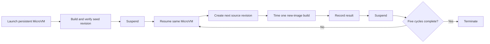

# Repeated suspend/resume build-server benchmark methodology

Status: proposed for agreement before implementation or another AWS run.

The existing benchmark and its 2026-07-19 results used one suspend/resume cycle.
They are useful earlier evidence, but they are not results from this
methodology.

## The experiment in one sentence

Seed a build cache on a MicroVM, then repeatedly **resume it, change the source,
time one new-image build, and suspend it again**, comparing every warm build
with the same revision built on a fresh MicroVM.

That repeated lifecycle is the benchmark. Exact rebuilds, package-manager tests,
compiler-only tests, concurrent builds, and GitHub runner timing are different
experiments and must not be mixed into the core run.

## What we want to establish

The primary question is:

> Across repeated job-like suspend/resume boundaries, does the same MicroVM
> retain correct and useful Docker build state for the next new image?

The benchmark should separately report:

1. **Correctness:** every cycle produces the artifact for the new source
   revision, never a stale cached artifact.
2. **Build performance:** the first Docker build after each resume compared with
   the same revision on a clean MicroVM.
3. **Job-like latency:** resume-to-build-complete compared with fresh
   provision-to-build-complete.
4. **Durability:** whether correctness, speed, or free disk space degrades over
   successive cycles.

It does not measure GitHub queueing, JIT runner registration, or registry push
time. Those require separate Action-level benchmarks.

## Fixed test shape

The default run uses:

- nine persistent ARM64 MicroVMs running as concurrent lanes;
- one seed build on each persistent MicroVM;
- five measured cycles on each persistent MicroVM;
- 45 warm new-image build samples; and
- one fresh-MicroVM control for each lane and cycle, producing 45 matched clean
  build samples.

If AWS quota limits concurrency, reduce concurrent lanes before reducing the
five repeated cycles. The report must show requested and actual counts.

Each persistent lane keeps the same MicroVM ID for its entire run. A replacement
MicroVM is not a continuation of that lane and must be reported as a failure or
a new lane.

## Core lifecycle



Every measured cycle is exactly:

```text
resume
create a deterministic new source revision
time the first workload Docker command: one new-image build
record its result
suspend
```

There is no second build before suspension.

## Workload

The primary workload is a multi-stage Node 24 Docker image that builds a
500-module TypeScript project.

All external inputs are pinned:

- base images by digest;
- npm dependencies by lockfile;
- TypeScript and Node versions; and
- benchmark code and the runner-image artifact by commit and SHA-256.

Revision zero seeds the persistent server. Cycle `n` adds a deterministic,
cumulative source change containing the lane and cycle number. The change must:

- alter application source and the expected compiled output;
- leave dependency manifests unchanged; and
- invalidate the source-copy and compilation portion of the image while leaving
  dependency layers eligible for normal reuse.

This is a genuinely new image build, not an unchanged-context cache hit. Each
cycle gets a unique image tag and expected artifact value.

The Dockerfile must validate the compiled artifact during the build itself. A
build exits non-zero unless the output contains the exact expected lane and
cycle revision. This makes correctness part of the timed operation without
needing an untimed `docker run` before the next suspension.

Dependency-changing revisions are valuable but answer a different question. They
should be a separately labelled benchmark after this source-change design is
established.

## Procedure

### 1. Seed each persistent server

1. Launch the MicroVM and time provision-to-`RUNNING`.
2. Establish shell readiness with a no-op command that does not invoke Docker.
3. Materialize revision zero and record its input-tree hash.
4. Build the seed image and require its in-build artifact check to pass.
5. Record the seed duration and image ID emitted by the build.
6. Suspend the MicroVM and wait for `SUSPENDED`.

The seed build is setup data, not a warm-cycle sample.

### 2. Run five measured cycles

For cycle `n` on each persistent server:

1. Start a host monotonic timer immediately before calling the resume API.
2. Resume the same MicroVM and wait for `RUNNING`.
3. Record resume-to-`RUNNING` duration.
4. Establish shell readiness with a no-op command. Do not issue a benchmark
   Docker command. The production supervisor's normal resume hook is allowed to
   check and restart Docker; that behavior is part of the system under test and
   must not be disabled for the benchmark.
5. Materialize deterministic source revision `n` and record its input-tree hash.
   Source-generation time is outside the build-only timer but remains inside
   resume-to-build-complete.
6. Start a guest monotonic timer immediately before the fixed build command,
   using `DOCKER_BUILDKIT=1`, plain progress output, and an image-ID file.
7. Build a new cycle-specific image with normal Docker and BuildKit caching. Do
   not use `--no-cache`, prune, pull, inspect, run, or manually prewarm Docker.
8. Require the Dockerfile's revision-specific artifact check to pass.
9. Stop the build timer when `docker build` exits. Capture the image ID directly
   from the build, without a follow-up Docker command.
10. Record build-only and resume-call-to-build-complete durations.
11. Record lightweight root-filesystem free space without scanning Docker's data
    root.
12. Immediately call suspend, wait for `SUSPENDED`, and record the duration.
13. Record how long the server remains in `SUSPENDED` before its next resume.

The benchmark issues no `docker info`, `docker image inspect`, `docker run`,
exact rebuild, `docker system df`, cache export, or recursive disk scan between
the measured build and suspension. Those operations could change or warm the
state seen after the next resume. Docker commands required by the unmodified
production suspend/resume hooks are recorded and allowed.

Record full Docker and disk metadata before the seed build. After the fifth
measured cycle has reached `SUSPENDED`, a separate untimed diagnostic resume may
collect final metadata before termination. That diagnostic resume is not a sixth
cycle and contributes no performance sample. If per-cycle cache inspection is
desired, run it in a separate diagnostic cohort.

### 3. Run the matched clean control

For every persistent lane and cycle:

1. Launch a fresh MicroVM from the identical runner image.
2. Establish shell readiness without invoking Docker.
3. Materialize the exact same source revision and confirm its input-tree hash
   matches the warm sample.
4. Time its first Docker command building the same image and require the same
   in-build artifact check.
5. Record build-only and provision-call-to-build-complete durations.
6. Terminate the clean MicroVM. Never reuse it for another control.

Interleave clean controls with warm cycles to reduce time-of-day and service
load bias. They may run at lower bounded concurrency to respect quota.

“Clean” means no benchmark-created state. Layers already present in the common
runner image are allowed in both cohorts. Do not call this a cold network pull
unless the run explicitly guarantees one.

## Primary measurements

For every lane and cycle, retain:

- warm first-build-after-resume duration;
- clean first-build-after-provision duration;
- paired warm/clean build-time ratio;
- resume-call-to-build-complete duration;
- provision-call-to-build-complete duration;
- resume-to-`RUNNING` and suspend-to-`SUSPENDED` duration;
- suspended dwell duration before the next measured resume;
- input-tree hash, expected revision, image ID, and artifact-check result; and
- root free space and observed guest resources.

Use monotonic clocks. Store unrounded milliseconds in raw output and round only
for presentation.

## Analysis

Publish:

- raw per-lane, per-cycle samples;
- count, minimum, p50, p90, p95, maximum, and mean;
- paired warm/clean speedups;
- the proportion of pairs in which the warm build is faster;
- results broken out by cycle number;
- each persistent server's median across its five cycles;
- first-cycle versus fifth-cycle performance and free-space change; and
- correctness, lifecycle, and cleanup success rates.

The MicroVM is the replication unit. The five cycles on one server are repeated
observations, not five independent servers. If confidence intervals are added,
resample by server.

Never discard the first build after resume: it is the primary sample. Preserve
failures and retries in the raw data. Any excluded infrastructure failure must
be identified with a rule established before reading performance results.

## Decision rules to agree before running

Correctness is non-negotiable: every result presented as successful must pass
the revision-specific in-build artifact check, and all lifecycle transitions
must retain the same lane MicroVM ID.

The proposed threshold for a strong performance claim is:

- at least 80% of matched warm builds are faster than clean builds; and
- paired p50 build-time speedup is at least `2.0x`.

These numbers are deliberately proposed before seeing the new results. They can
be changed before the run if they do not match the claim we want to make, but
must not be moved afterward to make the result look successful.

A result below the threshold is still published; it supports only the weaker
conclusion shown by the data. Lifecycle correctness and performance are separate
conclusions.

## Adversarial safeguards

- The first benchmark workload Docker command after resume is always the timed
  new-image build; the production supervisor's Docker readiness/restart behavior
  remains enabled.
- No exact rebuild is reported as a new-image build.
- No post-build workload is allowed to warm the server before suspension.
- Warm and clean members of a pair use identical source and runner-image inputs.
- Source changes are deterministic and similar in size across cycles and lanes.
- Actual CPU and memory are recorded; requested memory is not presented as the
  observed allocation.
- Clean controls are interleaved, not collected in a separate time window.
- Failed samples remain visible, and raw measurements are published.
- `overlay2`, `fuse-overlayfs`, and `vfs` results are never pooled.
- The final report cannot reuse the old single-resume results as though they
  were generated by this design.

## Explicitly separate follow-up benchmarks

The following may be useful later but do not belong in this core run:

- unchanged-context exact Docker cache hits;
- npm cache and TypeScript incremental-artifact timing;
- three simultaneous builds on one server;
- service and job containers;
- different suspended dwell times;
- dependency-manifest changes;
- registry push/pull behavior;
- GitHub queue and JIT runner pickup; and
- storage-driver comparisons.

Keeping these separate ensures that each suspension follows exactly the new
image build whose cache state the next cycle will inherit.

## Reproducibility and cleanup

Publish the frozen methodology, implementation commit, raw JSON, generated
summary, human report, source and image hashes, and sanitized orchestration
logs.

The orchestrator must terminate clean controls immediately and persistent
servers in a `finally` path. On interruption it must enumerate resources from
the benchmark run and terminate every non-terminal MicroVM. Temporary images,
objects, and repository credentials are deleted after collection.

Every report ends with the observed count of remaining non-terminated benchmark
MicroVMs.

## Limits

This design covers one account, Region, runner image, workload, and preview
service period. It does not establish an SLA, eight-hour durability, cross-
Region behavior, or performance for another storage driver.

The production `vfs` fallback remains a correctness path. It must not inherit
performance claims from `overlay2` without a separate repeated-cycle run.
